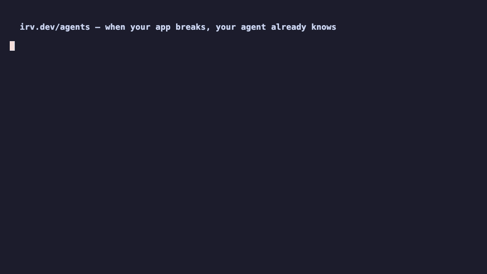

# irv-agent-test

> A reproducible harness for testing Irv's autonomous-onboarding flow with Codex CLI and Claude CLI.

One command. The agent provisions an Irv identity, edits the target Next.js app to insert the tracking snippet, fires test events, polls the freshness endpoint, and reports the dashboard URL. The harness then verifies the outcome black-box.

## Layout

```
.
├── target/                    a small Next.js app — the thing the agent instruments
│   ├── app/
│   │   ├── layout.tsx         no <head>-level analytics yet (that's the agent's job)
│   │   ├── page.tsx           landing with "Sign up" button → /signup
│   │   └── signup/page.tsx    a form (collects email)
│   └── package.json
├── runs/
│   ├── prompt.md              the canonical prompt — same for both agents
│   ├── reset.sh               restore target/ to baseline (drops the agent's edits)
│   ├── codex.sh               invoke Codex CLI with prompt.md
│   ├── claude.sh              invoke Claude CLI with prompt.md
│   ├── manual.sh              bash version of the same recipe (sanity floor)
│   ├── webhook-receiver.mjs   signature-verifying receiver for irv webhooks (closed loop)
│   ├── traffic.mjs            synthetic traffic generator (--broken flatlines signups)
│   ├── break.sh               the demo bug: signup submit → silent no-op (one-token diff)
│   └── unbreak.sh             revert the bug / confirm the agent's fix
├── docs/
│   └── demo-script.md         scene-by-scene plan for the launch video
├── verify.ts                  post-run assertions: hits Irv API, reads target/
├── results/                   per-run output (gitignored)
└── package.json
```

## Setup

```bash
# 1. Clone + install
git clone https://github.com/irvdotdev/irv-agent-test
cd irv-agent-test
pnpm install        # installs verify.ts deps; agent CLIs are separate (see below)
pnpm --filter target install

# 2. Get a beta key from /app/admin/agent-beta
export IRV_BETA_KEY=bk_xxxxxxxxxxxxxxxxxxxxxxxxxxxxxxxx
export IRV_HOST=https://irv.dev          # or your preview URL

# 3. (Optional) install the agent CLIs you want to test
npm install -g @openai/codex             # Codex CLI
npm install -g @anthropic-ai/claude-code # Claude CLI
```

## Run

```bash
# Reset the target app to baseline (no snippet, no PAT files)
./runs/reset.sh

# Pick an agent
./runs/codex.sh                 # → uses Codex CLI
./runs/claude.sh                # → uses Claude CLI

# OR run the manual recipe with pure curl + sed (proves the API works)
./runs/manual.sh

# After any run:
pnpm verify                     # checks the outcome, writes results/<timestamp>/verdict.json
```

The agent writes its captured PAT + project metadata to `target/.irv-test.json` (gitignored). `verify.ts` reads that file + hits the live API. If anything's missing, the verdict explains what went wrong.

## What gets verified

| Check | Pass criterion |
|---|---|
| Provision succeeded | `target/.irv-test.json` has `pat` + `project_id` + `project_key` |
| PAT works | `GET $IRV_HOST/api/v1/me` with the PAT returns 200 with the project |
| Snippet inserted | `target/app/layout.tsx` contains `i.js?p={project_key}` for the captured key |
| Events landed | `GET $IRV_HOST/api/v1/projects/{id}/events-freshness?since=5m` → `count >= 1` |
| No secrets leaked | `grep -r 'bk_' target/ results/` returns nothing (PAT is fine in `.irv-test.json` since it's gitignored) |

If all five pass: `verdict.json: { pass: true }`. Else lists the failures.

## Comparing agents

Each run is timestamped under `results/`:

```
results/
├── 2026-06-09T13-22-codex/
│   ├── transcript.txt    full agent stdout/stderr
│   ├── diff.patch        what the agent changed in target/
│   ├── irv-test.json     captured PAT + project info (PAT redacted in the saved copy)
│   └── verdict.json      pass/fail + reasons + duration
└── 2026-06-09T13-31-claude/
    └── ...
```

`pnpm compare` diffs the most recent codex run against the most recent claude run on the same target — same prompt, same target, different agent.

## Sanity floor: `runs/manual.sh`

If both agents fail, run `./runs/manual.sh` — it's pure curl + sed. If the manual recipe also fails, the issue is on Irv's side (or your network / beta key) and the agent harness is fine. If the manual recipe passes but agents fail, the issue is in agent prompting.

## The closed loop (webhooks)

Irv can wake your agent instead of being polled — see `irv.dev/agents` §7.9 + §9E. The harness pieces:

```bash
# 1. Receiver (verifies X-Irv-Signature, logs to results/webhook-deliveries.jsonl)
IRV_WEBHOOK_SECRET=whsec_… node runs/webhook-receiver.mjs

# 2. Public tunnel (Vercel can't POST to your localhost)
cloudflared tunnel --url http://localhost:8787      # or: ngrok http 8787

# 3. Subscribe
curl -sS -X POST "$IRV_HOST/api/v1/subscriptions" \
  -H "Authorization: Bearer $IRV_TOKEN" -H "Content-Type: application/json" \
  -d '{"project_key":"'$IRV_PROJECT_KEY'","url":"https://<tunnel>/","events":["insight.critical"]}'

# 4. Make something worth waking up for
node runs/traffic.mjs --minutes 15 --rate 20        # healthy baseline
./runs/break.sh                                      # the one-token bug
node runs/traffic.mjs --broken --minutes 15          # signups flatline
curl -sS -X POST "$IRV_HOST/api/v1/insights/refresh?project_key=$IRV_PROJECT_KEY" \
  -H "Authorization: Bearer $IRV_TOKEN"              # Irv notices → webhook fires
```

`pnpm verify` includes a subscription create → list → delete round-trip, so the basic plumbing is covered even without a tunnel.

The full scene-by-scene plan for filming this as the launch video: [docs/demo-script.md](docs/demo-script.md).

## License

MIT.

## The walkthrough video



Full ~2-minute cut: [docs/demo.mp4](docs/demo.mp4) — agent reads `irv.dev/agents` → provisions itself → instruments the app → Irv detects + fires HMAC-signed webhooks → agent ships the fix → outcome clock starts. **Every output shown is a real capture from the live rehearsal against prod** (see `docs/demo-assets/`); the player script paces them but invents nothing.

Re-render after changes: `vhs docs/demo.tape && vhs docs/demo-teaser.tape` (needs `brew install vhs`).
